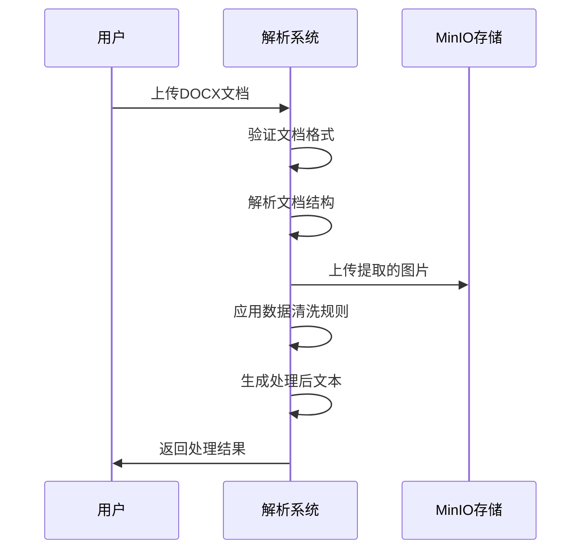

# 需求规格说明书

## 文档信息

| 项目 | 内容 |
|------|------|
| 文档标题 | DOCX 解析器需求规格说明书 |
| 版本号 | 1.0.0 |
| 创建日期 | 2025-08-11 |
| 最后更新 | - **标准格式**：
  ```
  [文档名称]-[一级章节序号] [一级章节名称]：
  <|SECTION|>[文档名称]-[一级章节序号] [一级章节名称]-[二级章节序号] [二级章节名称]：[二级章节内容]<|/SECTION|>
  <|SECTION|>[文档名称]-[一级章节序号] [一级章节名称]-[三级章节序号] [三级章节名称]：[三级章节内容]<|/SECTION|>
  ```
- **实际示例**：
  ```
  制造商部件申请V2.0-2 流程节点功能描述：
  <|SECTION|>制造商部件申请V2.0-2 流程节点功能描述-2.1 制造商部件申请：[该节点的具体功能描述内容]<|/SECTION|>
  <|SECTION|>制造商部件申请V2.0-2 流程节点功能描述-2.1.1 制造商部件申请创建：[该节点的具体功能描述内容]<|/SECTION|>
  ```25-08-11 |
| 文档状态 | 草稿 |

---

## 功能需求规格

### 功能名称
**文档解析与处理**

### 需求编号
`plm2-02-01`

### 功能描述

#### 1. 接收用户上传文档
- 支持用户上传 DOCX 格式文档
- 验证文档格式和完整性
- 提供上传状态反馈

#### 2. 解析文档
将 DOCX 文档解析为 text 文本格式，包含以下处理步骤：

**图片处理**
- 识别文档中的图片
- 不进行图片内容理解
- 将图片上传到 MinIO 存储系统

**表格处理**
- 识别表格结构
- 表格行序列化处理
- 每个大行合并成一段（优化思路）

#### 3. 处理文档
对解析得到的结构化JSON数据进行数据清洗，最终输出为标准化text文本，具体规则如下：

##### 3.1 删除首页
删除符合以下条件的内容：
- `type == 'table' and index == 0`:文档首页的表格
- `type == 'table' and index == 1 and rows[0][0]["content"]["text"] == "序号"`：文档首页的版本历史表格

##### 3.2 目录页处理（一级章节）
- **处理目标**：提取文档目录结构，保留层次关系和关键信息
- **内容过滤规则**：
  - **保留内容**：序号、章节名称、层次结构
  - **删除内容**：页码、装饰性元素、无关信息
- **输出格式**：采用 Markdown 层级标题格式
  ```
  # 一级标题
  ## 二级标题
  ### 三级标题
  ```
- **格式规范**：章节间用 `\n\n` 分隔
- **实际示例**：
  ```
  # 1 流程示意图
  # 2 流程模板
  # 3 流程节点功能描述
  ## 3.1 创建/修改申请
  ## 3.2 提交系统校验项
  ## 3.3 审核节点
  /n/n
  ```

##### 3.3 流程示意图处理（一级章节）
- **处理目标**：整合章节内的所有内容类型（文本、图片、表格）
- **命名规则**：`[文档名称]-[章节序号] [章节名称]`
- **内容组织策略**：
  - **文本内容**：paragraph类型内容直接拼接
  - **图片内容**：转换为Markdown格式 ``
  - **表格内容**：按照3.8节规则处理后用 `<|TABLE|>` 标签包裹
- **输出格式**：
  ```
  [文档名称]-1 流程示意图：
  [文本内容块1]  [文本内容块2] <|TABLE|>[表格内容]<|/TABLE|> [文本内容块3]
  /n/n
  ```
- **实际示例**：
  ```
  BOM审核申请-1 流程示意图：
  本流程展示BOM审核的完整过程  包含以下关键步骤 <|TABLE|><|ROW|>[步骤:1]|[名称:申请创建]|[负责人:申请人]<|/ROW|><|/TABLE|> 详细说明见下图
  /n/n
  ```

##### 3.4 流程模板处理（一级章节）
- **处理目标**：整合章节内的所有内容类型，重点关注模板表格和说明文档
- **命名规则**：`[文档名称]-[章节序号] [章节名称]`
- **内容组织策略**：
  - **文本内容**：paragraph类型内容直接拼接，提供模板使用说明
  - **图片内容**：转换为Markdown格式 ``，通常为模板截图
  - **表格内容**：按照3.8节规则处理，重点处理模板表格结构
- **输出格式**：
  ```
  [文档名称]-2 流程模板：
  [模板说明文本]  [使用说明文本] <|TABLE|>[模板表格内容]<|/TABLE|> [注意事项文本]
  ```
- **实际示例**：
  ```
  BOM审核申请-2 流程模板：
  请使用以下模板进行BOM审核申请  模板包含必填字段如下 <|TABLE|><|ROW|>[字段名:产品代码]|[类型:文本]|[必填:是]<|/ROW|><|ROW|>[字段名:申请原因]|[类型:文本]|[必填:是]<|/ROW|><|/TABLE|> 请确保所有必填字段完整填写
  /n/n
  ```

##### 3.5 流程节点功能描述处理（一级章节）
- **格式规则**：添加文档名称和层次前缀，包含所有二级章节内容
- **内容组织**：一级章节标题 + 二级章节集合（用分隔符隔开）
- **标准格式**：
  ```
  [文档名称]-[一级章节序号] [一级章节名称]：
  <|SECTION|>[文档名称]-[一级章节序号] [一级章节名称]-[二级章节序号] [二级章节名称]：[二级章节内容]<|/SECTION|>
  <|SECTION|>[文档名称]-[一级章节序号] [一级章节名称]-[二级章节序号] [二级章节名称]：[二级章节内容]<|/SECTION|>
  /n/n
  ```
- **实际示例**：
  ```
  BOM审核申请-3 流程节点功能描述：
  <|SECTION|>BOM审核申请-3 流程节点功能描述-3.1 创建/修改申请（BAU-010）：[该节点的具体功能描述内容]<|/SECTION|>
  <|SECTION|>BOM审核申请-3 流程节点功能描述-3.2 提交系统校验项：[该节点的具体功能描述内容]<|/SECTION|>
  /n/n
  ```

##### 3.6 子章节处理（二级章节）
- **处理目标**：处理一级章节下的二级章节内容
- **命名规则**：`[文档名称]-[一级章节序号] [一级章节名称]-[二级章节序号] [二级章节名称]`
- **内容组织策略**：
  - **文本内容**：paragraph类型内容按照3.7节规则处理
  - **图片内容**：转换为Markdown格式 ``
  - **表格内容**：按照3.8节规则处理后用标签包裹
  - **列表内容**：按照3.7节规则处理
- **输出格式**：每个二级章节用 `<|SECTION|>` 标签包裹
  ```
  <|SECTION|>[文档名称]-[一级章节序号] [一级章节名称]-[二级章节序号] [二级章节名称]：[处理后的章节内容]<|/SECTION|>
  ```
- **实际示例**：
  ```
  <|SECTION|>BOM审核申请-3 流程节点功能描述-3.1 创建/修改申请（BAU-010）：
  <|PARAGRAPH|>该节点负责处理BOM审核申请的创建和修改功能<|/PARAGRAPH|>
  
  <|TABLE|><|ROW|>[字段名:产品代码]|[必填:是]|[说明:产品唯一标识]<|/ROW|><|/TABLE|>
  <|/SECTION|>
  ```

##### 3.7 具体内容处理规则
根据内容类型使用相应标签包裹：

- **段落内容**：`<|PARAGRAPH|>[内容]<|/PARAGRAPH|>`
  - 连续的paragraph元素会被合并为一个大段落
  - 合并时提取各段落的text属性并连接
  
- **列表项**：`<|LISTITEM|>[内容]<|/LISTITEM|>`
  
- **表格内容**：`<|TABLE|>[内容]<|/TABLE|>`
  - 按照3.8节的表格处理规则处理
  
- **图片内容**：``
  - 使用 Markdown 格式的图片链接

##### 3.8 表格专项处理规则
- **表格标识**：表格整体用 `<|TABLE|>[内容]<|/TABLE|>` 标签包裹
- **行合并组分割**：具有相同列合并单元格的行组用 `<|RSPAN|><|/RSPAN|>` 分割
- **单行分割**：每个数据行用 `<|ROW|>[内容]<|/ROW|>` 分割
- **表头处理**：将表头信息（第一行）嵌入到每个数据行中，格式为 `[表头:内容]`
- **行内格式**：同一行各列用 `|` 分割，采用 Markdown 表格格式

**处理示例**：
```
原始表格：
| 姓名 | 年龄 | 部门 |
| 张三 | 25  | 技术 |
| 李四 | 30  | 销售 |
|     |     | 技术 |
| 王五 | 35  | 销售 |
|     |     | 管理 |

处理结果：
<|TABLE|>
<|ROW|>[姓名:张三]|[年龄:25]|[部门:技术]<|/ROW|>
<|ROW|>[姓名:李四]|[年龄:30]|[部门:销售]<|/ROW|>
<|RSPAN|>
<|ROW|>[姓名:王五]|[年龄:35]|[部门:技术]<|/ROW|>
<|ROW|>[姓名:王五]|[年龄:35]|[部门:销售]<|/ROW|>
<|ROW|>[姓名:王五]|[年龄:35]|[部门:管理]<|/ROW|>
<|/RSPAN|>
<|/TABLE|>
```

##### 3.9 接口处理（一级章节）
- **处理目标**：处理文档中的接口相关内容，通常包含API规范、数据格式等
- **命名规则**：`[文档名称]-[章节序号] 接口`
- **内容组织策略**：采用与"流程节点功能描述"相同的处理方式
  - **文本内容**：paragraph类型内容按照3.7节规则处理
  - **图片内容**：转换为Markdown格式，通常为接口截图或架构图
  - **表格内容**：按照3.8节规则处理，重点处理参数表、返回值表等
- **输出格式**：
  ```
  [文档名称]-N 接口：
  <|SECTION|>[文档名称]-N 接口-N.1 [子章节名称]：[子章节内容]<|/SECTION|>
  <|SECTION|>[文档名称]-N 接口-N.2 [子章节名称]：[子章节内容]<|/SECTION|>
  /n/n
  ```

##### 3.10 其他内容处理（一级章节）
- **处理目标**：处理不属于上述特定类型的其他一级章节内容
- **命名规则**：`[文档名称]-[章节序号] [实际章节名称]`
- **内容组织策略**：采用与"流程节点功能描述"相同的处理方式
  - 如果包含二级章节，按照3.5节的嵌套格式处理
  - 如果只有一级内容，直接按照内容类型进行处理
- **输出格式**：
  ```
  # 有二级章节的情况：
  [文档名称]-N [章节名称]：
  <|SECTION|>[文档名称]-N [章节名称]-N.1 [子章节名称]：[子章节内容]<|/SECTION|>
  
  # 无二级章节的情况：
  [文档名称]-N [章节名称]：[直接处理的章节内容]
  /n/n
  ```

---

### 📋 **统一处理逻辑总结**

#### **章节命名统一规范**
所有章节统一采用：`[文档名称]-[章节序号] [章节名称]` 格式

#### **内容类型处理统一规范**
1. **文本内容**：使用 `<|PARAGRAPH|>[内容]<|/PARAGRAPH|>` 标签
2. **图片内容**：使用 Markdown 格式 ``
3. **表格内容**：使用 `<|TABLE|>[内容]<|/TABLE|>` 标签，按照3.8节规则处理
4. **列表内容**：使用 `<|LISTITEM|>[内容]<|/LISTITEM|>` 标签

#### **章节层次处理统一规范**
1. **一级章节**：直接输出，格式为 `[文档名称]-[序号] [章节名称]：[内容]`
2. **包含二级章节的一级章节**：使用 `<|SECTION|><|/SECTION|>` 分隔符包裹二级章节
3. **二级章节**：使用 `<|SECTION|>[章节标题]：[内容]<|/SECTION|>` 格式

#### **表格处理统一规范**
1. **表格整体**：使用 `<|TABLE|><|/TABLE|>` 标签包裹
2. **行合并组**：使用 `<|RSPAN|><|/RSPAN|>` 标签包裹
3. **单个数据行**：使用 `<|ROW|><|/ROW|>` 标签包裹

#### **特殊章节处理规范**
1. **目录页**：转换为 Markdown 层级标题格式
2. **首页**：根据条件删除
3. **流程示意图/模板**：重点处理图片和说明文字的组合
4. **流程节点功能描述**：重点处理二级章节的嵌套结构

---

## 接口规格

### 输入
| 参数 | 类型 | 描述 | 必填 |
|------|------|------|------|
| 用户文档 | DOCX | 需要解析的 Word 文档 | ✅ |

### 输出
| 参数 | 类型 | 描述 |
|------|------|------|
| 处理结果 | Text | 解析并处理后的文档文本 |
| 状态信息 | JSON | 处理状态和元数据信息 |

---

## 操作序列



---

## 扩展及异常处理

### 异常情况
1. **文档格式错误**
   - 标记文档为待处理状态
   - 返回格式错误提示

2. **文档损坏**
   - 记录错误日志
   - 通知用户重新上传

3. **图片上传失败**
   - 重试机制（最多3次）
   - 失败后记录日志继续处理文本

4. **内存不足**
   - 启用快速模式处理
   - 分块处理大文档

### 扩展功能
1. **批量处理**
   - 支持多文档同时处理
   - 进度跟踪和状态报告

2. **处理历史**
   - 保存处理记录
   - 支持重新处理

---

## 补充说明

### 技术实现要点
1. **性能优化**
   - 使用模块化架构提升处理速度
   - 支持快速模式跳过复杂转换

2. **可靠性保证**
   - 完整的错误处理机制
   - 详细的日志记录

3. **扩展性设计**
   - 支持新的文档格式扩展
   - 可配置的处理规则

### 质量标准
- 文档解析准确率 ≥ 95%
- 图片提取成功率 ≥ 99%
- 单文档处理时间 ≤ 5秒
- 系统可用性 ≥ 99.9%

### 参与用户
- **主要用户**：PLM 系统用户
- **管理员**：系统管理员
- **开发者**：API 调用方

---

## 变更历史

| 版本 | 日期 | 修改内容 | 修改人 |
|------|------|----------|--------|
| 1.0.0 | 2025-08-11 | 初始版本创建 | 胡佩文 |

---

*本文档遵循 [需求规格说明书标准](https://github.com/SansAppel-PW/Docx_parser) 编写规范*
